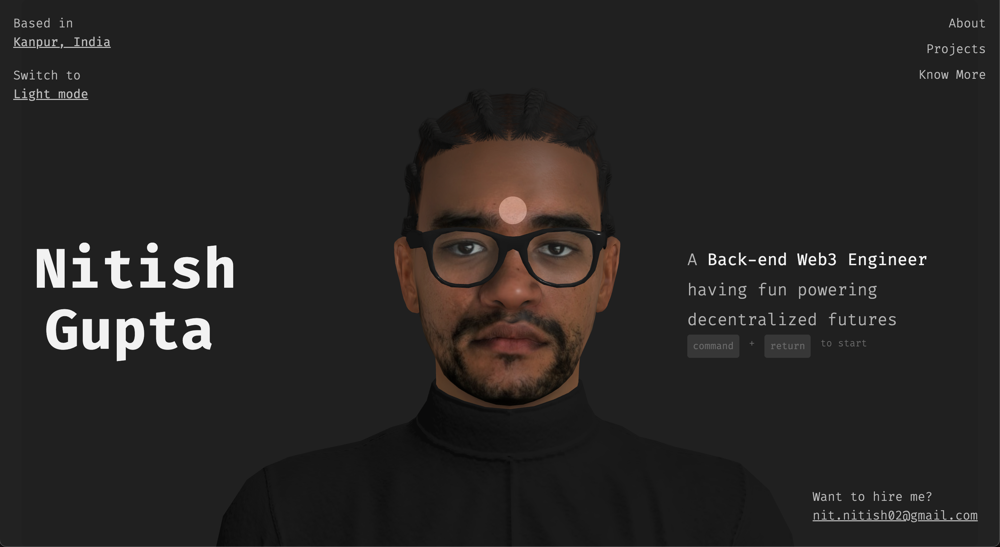

## My personal website

This is my personal portfolio website showcasing who I am, the projects I've built, skills I've mastered and my journey in the world of Web3, blockchain and software development. It's built to serve as a digital home where you can connect with me, explore my work and learn more about me.


  


## 🚀 Features

- Modern and responsive design
- Built with React.js for optimal performance
- Interactive 3D elements using Three.js
- Syntax highlighting for code snippets
- Google Analytics integration (manual)
- SEO optimized with sitemap generation (manual)
- Tailwind CSS for styling
- SASS support for custom styling

## 🛠️ Tech Stack

- [React](https://reactjs.org/) - JavaScript library for building user interfaces
- [Three.js](https://threejs.org/) - 3D graphics library
- [Tailwind CSS](https://tailwindcss.com/) - Utility-first CSS framework
- [SASS](https://sass-lang.com/) - CSS preprocessor
- [React Syntax Highlighter](https://github.com/react-syntax-highlighter/react-syntax-highlighter) - Code syntax highlighting

## 🏗️ Getting Started

### Prerequisites

- Node.js (v14 or later)
- Yarn or npm package manager

### Installation

1. Clone the repository:
   ```bash
   git clone https://github.com/Nitish-d-Great/Portfolio-Website.git
   cd Portfolio-Website/Nitish
   ```

2. Install dependencies:
   ```bash  
   yarn install
   # or
   npm install
   ```

3. Start the development server:
   ```bash
   yarn start
   # or
   npm start
   ```

The site will be available at `http://localhost:3000`

## 📝 Available Scripts

- `yarn start` or `npm start` - Start development server
- `yarn build` or `npm run build` - Build for production
- `yarn test` or `npm run test` - Run tests
- `yarn eject` or `npm run eject` - Eject configuration

## 🔧 Configuration

The project uses several libraries and configurations:

- React Router for routing
- Tailwind CSS for utility-first styling
- SASS for custom styles
- Three.js for 3D elements

## 📄 License

This project is licensed under the MIT License - see the [LICENSE](LICENSE) file for details.

## 👤 Author

Nitish Gupta
